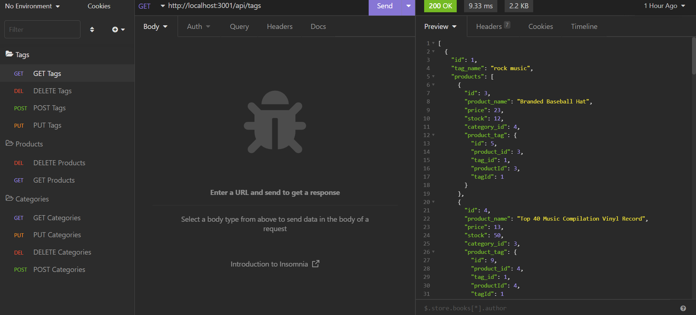
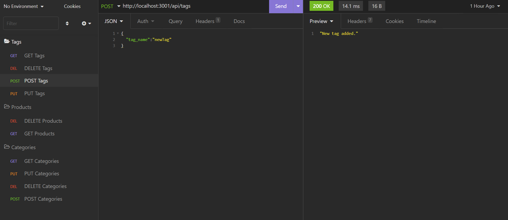
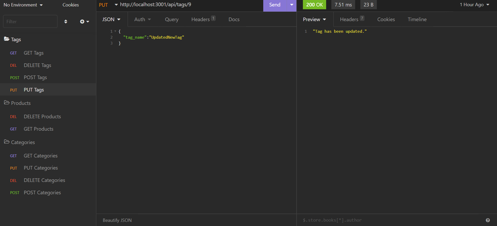
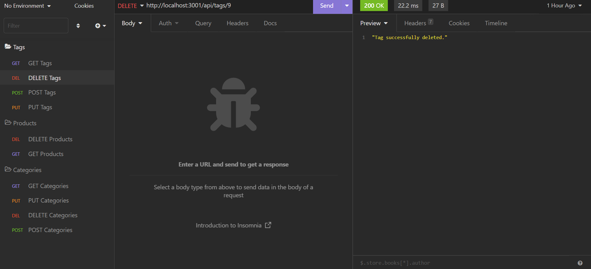
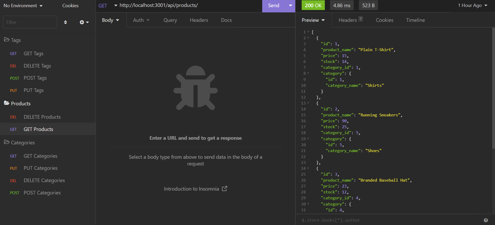
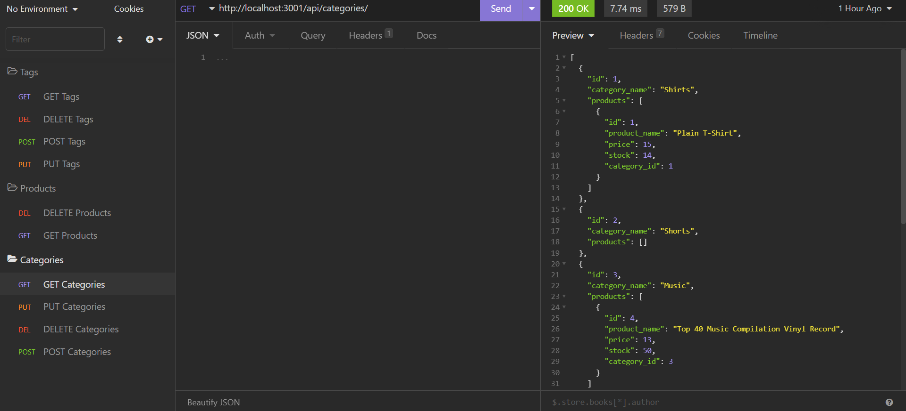

# Store Backend

## Introduction

Backend routes for GET, PUT, POST, and DELETE functions in the backend using sequelize and mysql2.

## Table of Contents 
1. [Installation](#installation)
2. [Usage](#usage)
3. [Test](#test)
4. [Images](#images)
5. [Credits](#credits)
6. [Licenses](#licenses)

## Installation 

1. Clone repository from https://github.com/EllisJLC/ecommerce_back. 
2. Initialize the database by running starting msyql in the repository directory and run "source db/schema.sql" to initialize the database. 
3. Run "node seeds/index.js outside of mysql to seed data.

## Usage

To keep track of store inventory through adding, changing, or deleting items, tags, or categories.

## Test

1. Run the program using "npm start" in the terminal. 
2. Use Insomnia to send requests to the backend.

## Images

### Get request for Tags

### Post request for Tags, adding new tag

### Put request for Tags, editing tag

### Delete request for Tags, removing tag

### Get request for Products

### Get request for Categories

## Credits

Project was started with given html, css, and JavaScript front end, backend communications set by Jia Liang (Ellison) Chen.

## Licenses 

The MIT License: https://opensource.org/licenses/MIT